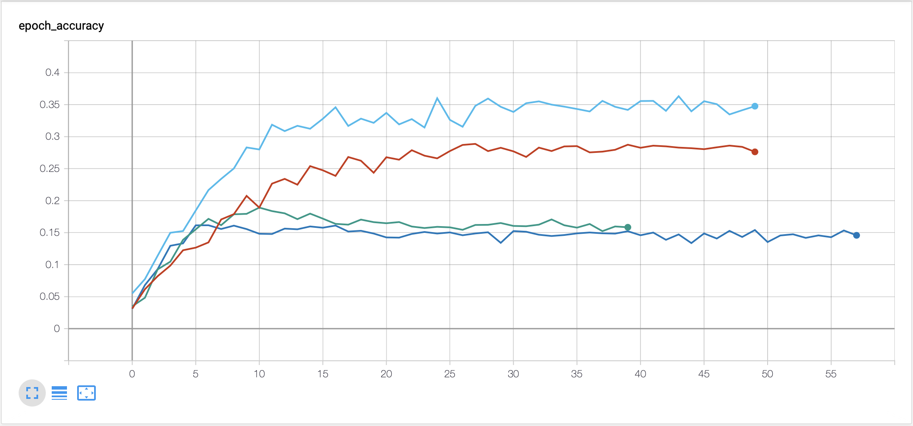

# Task
The task we are solving is classification of 120 of dog breeds.
http://vision.stanford.edu/aditya86/ImageNetDogs/

# Docker setup
After cloning the repo, run `$ sh ./build_docker.sh` to build the docker image, 
and `$ sh ./run_docker.sh` or `sh ./run_nvidia_docker.sh` based on if you want to use GPU.

After that execute `$ docker exec -it <container_id> bash` to be able to run scripts.

# Data preprocessing
For data preprocessing run `python prepare_data.py`. This downloads and extracts the images from stanford website, 
splits them into test and train dataset, crops the images according to the annotations, resize them and pads them with
black pixels so all of them are 400x400px. You can find the preprocessed images in `/dog_breeds_data/test` 
and `/dog_breeds_data/train` after running the script

# Augmentation
We implemented realtime data augmentation using keras ImageGenerator. Transformation applied at random during training 
of the best models:
 - horizontal_flip - images were horizontally flipped at random
 - rotation_range=25 - images were rotated up to +-25 degrees at random
 - shear_range=10 - images were skewed up to 10 degrees clokwise at random
 
We experimented at also with zooming, unzooming, and shifting channel values, which might help, but increased the training time heavily
which we couldn't afford due to the deadline approaching us at rapid speed.

You can view examples of augmented data in `Prediction_evaluation.ipynb`

# Model
We're using 3 Inception layers with maxpooling and batch normalization, you can find the implementation in `model.py`

# Training
To train the model run `python train.py`. You can set these hyperparamaters via commandline arguments:

- learning rate (`-lr, --learning-rate`)
- batch size (`-b, --batch-size`)
- epochs (`-e, --epochs`)
- name of the run (`-r, --run-name`) - logs and model checkpoints will be saved with this name

Accuracy and loss are logged in tensorboard format to `/logs` directory, and best model from the run will be saved in `/best_models`.

## Training hardware
We trained our models on google cloud platform using virtual machine with 2 CPUs, 13 GB RAM and NVIDIA Tesla P100.

## Training process
We experimented with different hyperparameters and augmentation methods and ran ~10 training runs, below you can see v
alidation accuracy progress during runs which increased accuracy:

- Dark blue - baseline model ~16% accuracy
- Green - Added batch normalization after every conv layer ~ 19% accuracy
- Red - Added data augmentation ~ 29% accuracy
- Light blue - Different train/test split changed to 80/20 before it was around 60/40 ~ 36% accuracy

Best model ended up being the light blue one, names as `more_train_data-lr0.0003` in tensorboard logs. 
You can view detailed evaluation of the model in `Prediction_evaluation.ipynb`

